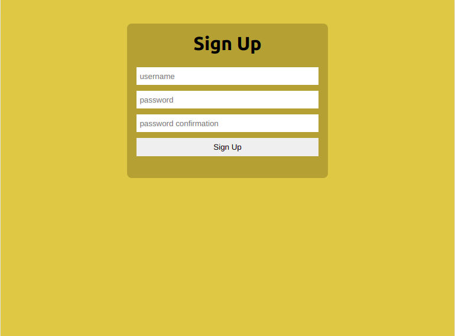
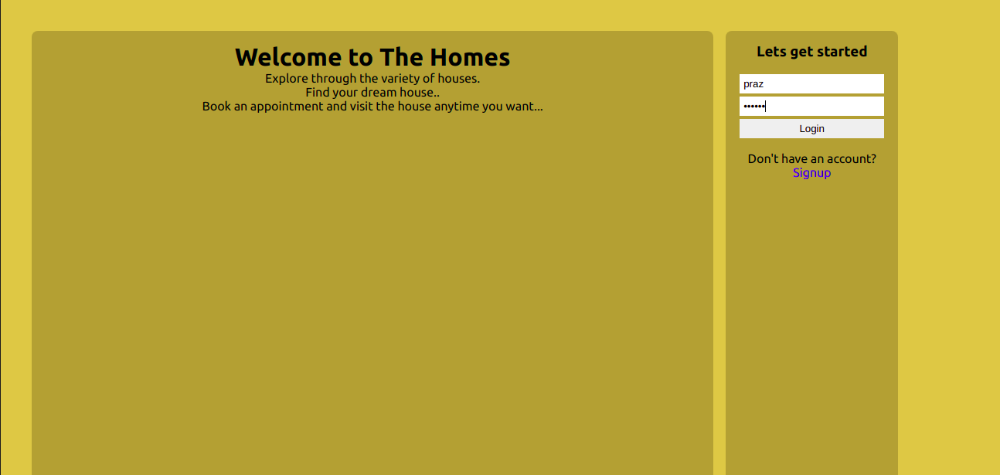
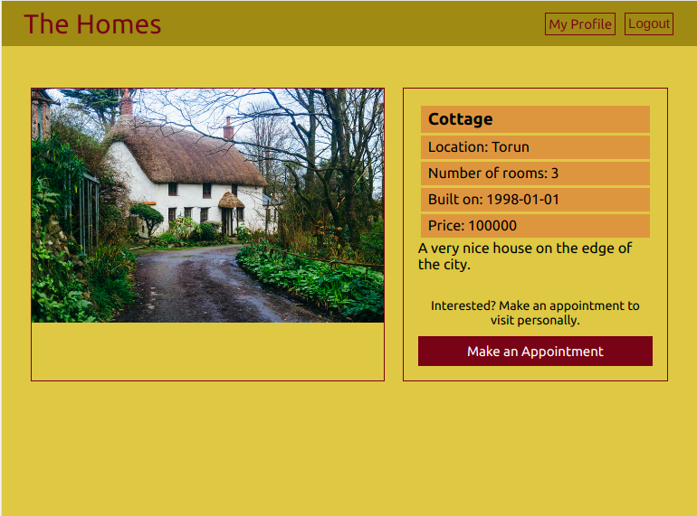
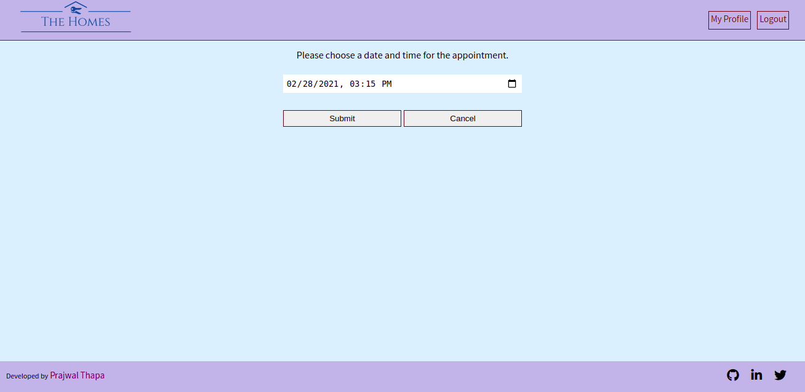
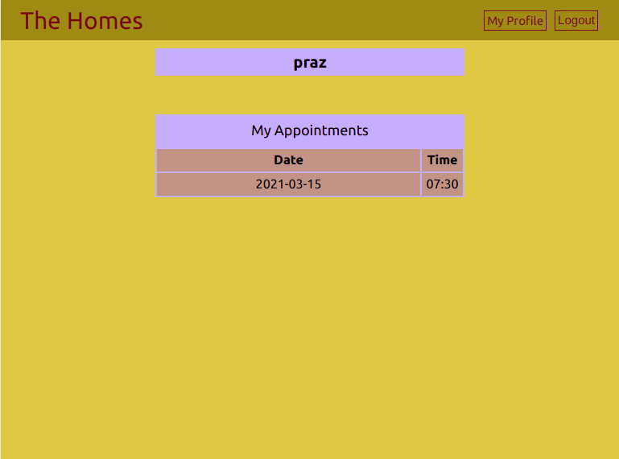

# The Home Appointments

>This the the frontend part for the capstone project of [Microverse](https://www.microverse.org/) main technical curriculum.  
>This project is an appointment making app where users are able to see a list of different types of houses and book an appointment for a personal visit to a particular house.
>Users can see the details of a particular house by clicking the 'See details' button.
<div align="center">

[](https://github.com/praz99/appointments-frontend)
[](https://github.com/praz99/appointments-frontend/issues)
[](https://github.com/praz99/appointments-frontend/pulls)

</div>

## 📝 Contents

<p align="center">
<a href="#with">Built with</a>&nbsp;&nbsp;&nbsp;|&nbsp;&nbsp;&nbsp;
<a href="#ss">Screenshots</a>&nbsp;&nbsp;&nbsp;|&nbsp;&nbsp;&nbsp;
<a href="#features">Main Features</a>&nbsp;&nbsp;&nbsp;|&nbsp;&nbsp;&nbsp;
<a href="#ll">Live Demo Link</a>&nbsp;&nbsp;&nbsp;|&nbsp;&nbsp;&nbsp;
<a href="#gs">Getting started</a>&nbsp;&nbsp;&nbsp;|&nbsp;&nbsp;&nbsp;
<a href="#testing">Testing</a>&nbsp;&nbsp;&nbsp;|&nbsp;&nbsp;&nbsp;
<a href="#author">Author</a>&nbsp;&nbsp;&nbsp;|&nbsp;&nbsp;&nbsp;
</p>

## 🔧 Built with<a name = "with"></a>
- ReactJS
- React-Redux
- HTML 5 and CSS 3

## API<a name= "backend"></a>

The backend API for this project created by me and can be found in [github](https://github.com/praz99/appointments-backend).

## Screenshots<a name = "ss"></a>







## Main Features<a name = "features"></a>

- A proper authentication system has been implemented using JWT. Users are able to create a new account and login/logout securely.
- Users can see a list of different houses.
- Users can see the details of a particular house.
- Users can make an appointment on the date and time of their choice.
- Users can see all the appointments they have made in the Profile page.

## See Live<a name = "ll"></a>
See live on [Heroku](https://praz-appointments.herokuapp.com/)


## Getting Started <a name = "gs"></a>
This project was bootstrapped with [Create React App](https://github.com/facebook/create-react-app).

Make sure you have [Node](https://nodejs.org/en/), installed in your computer.   
Install [yarn](https://yarnpkg.com/getting-started/install). (or you can still use ```npm``` instead of ```yarn```.)

To get a local copy of the repository please run the following commands on your terminal:

```
$ git clone git@github.com:praz99/appointments-frontend.git
```
```
$ cd appointments-frontend
```

```
$ yarn install
```
```
$ yarn start
```

This runs the app in the development mode.
Open [http://localhost:3000](http://localhost:3000) to view it in the browser.

## Testing<a name = "testing"></a>
This app has been tested using the ```react-testing-library```.
Run ```yarn test``` in the console to run the tests.

## ✒️  Authors <a name = "author"></a>

👤 **Prajwal Thapa**

- Github: [praz99](https://github.com/praz99)
- Twitter: [@thapa_praz](https://twitter.com/thapa_praz)
- LinkedIn: [prazwal-thapa](https://linkedin.com/in/prazwal-thapa)
- Email: t.prazwal@gmail.com

## 🤝 Contributing

Contributions, issues and feature requests are welcome!

Feel free to check the [issues page](https://github.com/praz99/appointments-frontend/issues).


## 👍 Show your support

Give a ⭐️ if you like this project!

## :clap: Acknowledgements
- [Microverse](https://www.microverse.org/)

## 📝 License

This project is [MIT](./LICENSE) licensed.
